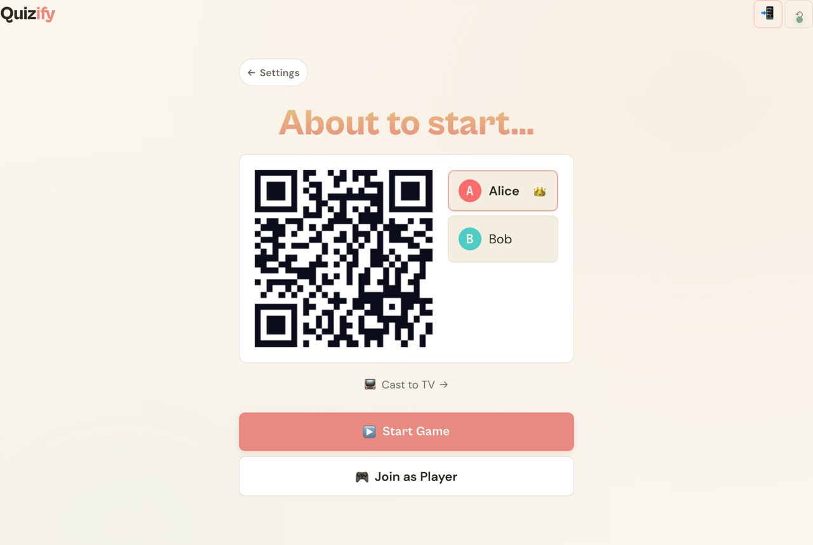
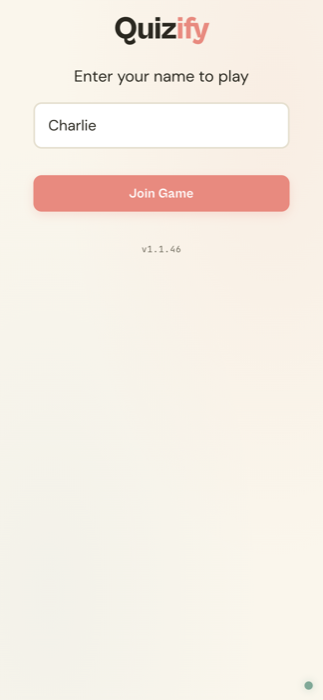
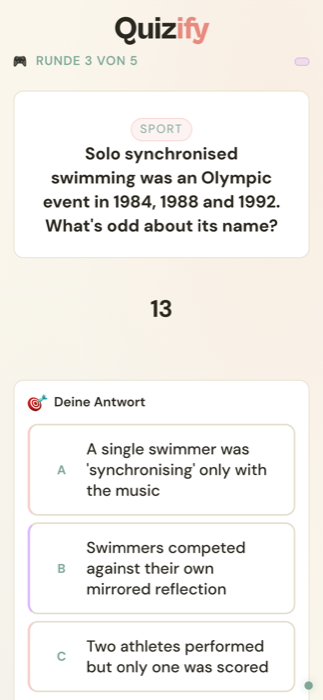
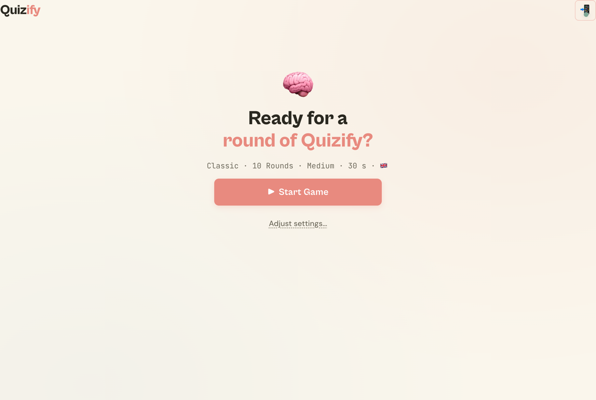
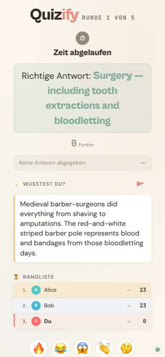
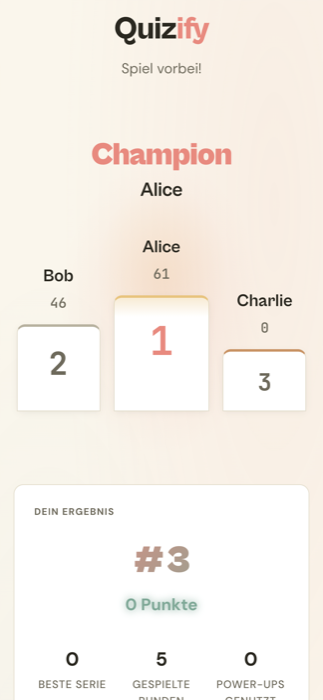

<div align="center">

# Quizify


### **Multiplayer Useless Knowledge Quiz Game for Home Assistant**

Turn any gathering into a trivia battle. Players scan, questions fly, everyone competes. No app needed.

[](https://www.home-assistant.io/)
[](https://github.com/mholzi/quizify/releases)
[](LICENSE)

[**Get Started**](#setup-in-home-assistant) • [**How to Play**](#the-experience) • [**Question Packs**](#question-packs) • [**See It In Action**](#the-experience)

---

</div>

<br>

## What Is Quizify?

**Quizify is an open-source trivia quiz game for Home Assistant** — a multiplayer party game that turns any phone in the room into a buzzer and any TV into a game-show screen.

A question appears. Everyone races to answer. Points fly. Streaks build. Champions emerge.

No apps to download. No accounts to create. Just scan a QR code and play.

<div align="center">



*The lobby. Players scan, drop in, scoreboard ready.*

</div>

---

<br>

## Why Parties Are Better With Quizify

**Zero Friction Entry** — Players scan a QR code. That's it. No apps. No accounts. No WiFi password drama. 10 seconds from scan to playing.

**Runs Fully Local** — No cloud. No subscription. No data leaves your network. Free and open-source. Your trivia, your network, your business.

**Solo or Squad** — Play alone for a couch session, or up to 20+ players for a full party. The host can self-join and play along, or just stay at the wheel.

**Everyone Competes** — Points, speed bonuses, streaks, five different power-ups, and a dramatic finale with podium and end-of-game awards. Real competition, real laughs.

**Works on Any Screen** — Dashboard mode for the TV. Players use their phones. Admin runs the show. No extra hardware needed.

**Eleven Themes, Three Languages** — 3,987 questions across 30 themed packs (Geography, Pop Culture, Animals & Nature, Sport, Music, Science, History, Food & Drink, Technology, World Cup, Estimation) in German, English and Spanish. Mix them, filter them, swap mid-session.

---

<br>

## Setup In Home Assistant

### Step 1: Install

**Via HACS (Recommended)** — One click to add the repository, then install:

[](https://my.home-assistant.io/redirect/hacs_repository/?owner=mholzi&repository=quizify&category=integration)

Or manually:
```
HACS → ⋮ Menu → Custom Repositories
→ URL: https://github.com/mholzi/quizify
→ Category: Integration
→ Install "Quizify"
→ Restart Home Assistant
```

**Manual**
```bash
cd /config/custom_components
git clone https://github.com/mholzi/quizify.git quizify
# Restart Home Assistant
```

### Step 2: Configure

[](https://my.home-assistant.io/redirect/config_flow_start/?domain=quizify)

Or manually:
```
Settings → Devices & Services → Add Integration → "Quizify"
```

That's it. Quizify is now installed.

---

<br>

## Opening Quizify (Admin)

After installation, access Quizify to start a game:

### Option 1: HA Sidebar (Recommended)

Quizify automatically adds itself to your Home Assistant sidebar.

1. Open Home Assistant
2. Look for **Quizify** in the left sidebar
3. Click to open the launcher
4. Hit **"Quizify öffnen"** / **"Open Quizify"** — navigates to `/quizify/admin`. The HA sidebar/header still wraps it; install Quizify as a PWA (next paragraph) if you want a truly chromeless fullscreen launcher.

> **Tip:** If you don't see Quizify in the sidebar, restart Home Assistant.

### Option 2: Direct URL

```
http://YOUR-HA-IP:8123/quizify/admin
```

### Option 3: HA Companion App

1. Open the HA Companion app
2. Tap the menu (☰) or swipe from left
3. Select **Quizify** from the sidebar

Quizify also installs as a **Progressive Web App** — once you've opened `/quizify/admin` from the launcher, tap the install prompt on the admin screen (browsers that support PWAs) and Quizify gets its own home-screen icon, fullscreen, no browser chrome.

### Hosting Requires a Home Assistant Login

The admin side of Quizify is protected by **your Home Assistant login**. The first time you open `/quizify/admin` on a device, you're sent to the normal HA login screen; after that the device stays signed in and opening Quizify is instant.

The first connection from a fresh HA instance also bootstraps a persistent **admin token** — only the device that bootstrapped it can fire `start_game`, `reset_game`, `end_game`, or `kick_player`. If a stranger finds the URL on your home network, they can connect as a player but **cannot** start, reset, or control the game.

> Lost your admin tab? Call the `quizify.reset_admin_session` service from Developer Tools → Services. The next admin connection re-bootstraps a fresh token.

**Players are unaffected** — joining at `/quizify/player` stays password-free, so guests still scan the QR code and play with zero friction.

<div align="center">



*What a guest sees after scanning the QR code. Type a name, tap Join.*

</div>

---

<br>

## The Experience

<div align="center">

### For Players



*Scan the QR. Type your name. Buzz in.*

</div>

**The Rush**
A question appears. The clock is ticking. Three answers. You think you know it... but is it really *that* one?

**The Strategy**
Answer fast for a speed bonus. Hit a streak for multiplier points. Got a Joker? Knock out one wrong answer and turn 33% into 50%.

**The Reveal**
The correct answer drops in a sage-green callout. The room reacts. Someone nailed it on a 5-streak. Someone burned their Joker on a question they would have gotten anyway. Everyone's laughing.

A fun fact appears for context ("Giraffen schlafen im Schnitt nur 1,9 Stunden am Tag…"). The leaderboard reshuffles with delta arrows. **Next round** is one tap away.

<br>

<div align="center">

### For Hosts



*Pick the pack. Pick the difficulty. Hit start.*

</div>

**Pick a pack, then a mode**
Choose your pack right on the first screen (featured card + chips), then a preset — Quick Round (5 rounds · Easy · 20s), Classic (10 rounds · Medium · 30s), Marathon (20 rounds · Hard · 45s) — or unfold the Custom panel to dial in language, difficulty, round count, and per-question timer.

**Solo or Squad**
Solo play is supported since v1.1.9 — host self-joins, lobby unlocks with one player. Or wait for up to 20 friends. The lobby shows the QR code, the join URL, and a live roster as people drop in.

**Full Control**
Reset the game at any time (header ⟲ button), end the game cleanly (finale + podium), kick a player out (× next to their name). The admin tab also redirects to the player view on game start, so you play along while staying in control.

**TV Dashboard**
Cast `/quizify/dashboard` to the TV for a shared spectator screen — large question, three answer tiles that flip green (correct) / red (wrong) at reveal, fun-fact card, top-5 leaderboard with streak markers, and the full podium at the finale. Players watch the TV, tap on their phones. _A live answer-distribution bar chart at reveal is on the roadmap — see [#151](https://github.com/mholzi/quizify/issues/151)._

---

<br>

## Game Features

<div align="center">



*Every round ends with the verdict, the fact, and the standings.*

</div>

### Scoring That Creates Drama

**Base formula (correct answers only):**

```
Points = (Base + Speed Bonus) × Difficulty × Streak × (×2 if Double Points power-up)
```

| Component | Value |
|-----------|-------|
| **Base points** | 10 |
| **Speed bonus** | up to +5 (linear, decays over time limit) |
| **Difficulty multiplier** | Easy ×1.0 / Medium ×1.5 / Hard ×2.0 |
| **Streak multiplier** | +10% per correct answer in a row, max +50% at 5× |
| **Wrong / timeout** | 0 pts, streak resets |

**Example:** Medium difficulty, instant answer, 3× streak in a row:
`(10 + 5) × 1.5 × 1.3 = **29 pts**`

### Time Limits

Two paths, two sets of defaults:

**Preset timers** (what you get clicking Quick / Classic / Marathon):

| Preset | Timer |
|--------|-------|
| ⚡ Quick Round | 20 s |
| 🧠 Classic | 30 s |
| 🏆 Marathon | 45 s |

**Difficulty-derived defaults** (when you change just the difficulty chip without a preset):

| Difficulty | Timer |
|------------|-------|
| Easy | 20 s |
| Medium | 15 s |
| Hard | 10 s |

Both are overridable from the Custom Settings panel — pick any timer in `5–300 s`.

### Streak Milestones

Three points where a streak yells at the room with a toast notification:

- **🔥 3 in a row** — first toast pops, +30 % streak multiplier kicks in
- **🔥🔥 5 in a row** — second toast, multiplier caps at +50 %
- **🔥🔥🔥 7 in a row — On fire!** — third toast for bragging rights

Miss one and the streak resets. The pressure is real.

### Power-Ups

One random player receives a random power-up at the start of each round. Use it during the question phase — power-ups are consumed immediately and **the public broadcast** tells everyone who used what.

| Power-Up | Effect |
|----------|--------|
| 🃏 **Joker** | Removes one wrong answer (33 % → 50 % chance of guessing right) |
| ✌️ **Double Points** | This round's points count double |
| 🥶 **Freeze** | Locks an opponent out of answering for 5 seconds — their clock keeps running, so they lose answer time (a real penalty, not a pause) |
| ⏱️ **Time Boost** | Adds +5 seconds to your own timer |
| 🥷 **Steal** | Takes 50% of a target player's current round points |

Freeze and Steal require selecting a target player — only offered when 2+ players are in the game.

On the **final round**, players can stake a wager (0–100 % of their points): a correct answer wins it, a wrong answer loses it. The wager only resolves if you actually answer — **timing out keeps your current points** (no win, no loss). This is intended behaviour and is shown in the wager UI so it isn't a hidden trap.

### Live Emoji Reactions (and a tiny scoring twist)

A reaction row sits below every reveal screen. Tap 🔥 😂 😱 👏 🤔 and your emoji floats across every other player's screen.

There's a small scoring mechanic baked in: **a reaction sent during the reveal grants +1 point to every player who answered that round correctly** — "audience appreciation". Each reactor can only grant the bonus once per round, and each correct answerer caps at +3 incoming bonus per round so a 6-player table can't pile free points on the leader every reveal. Reactions sent outside the reveal phase (lobby, mid-question) are pure visual.

### Late-Joiners Get a Fair Shake

If a friend shows up mid-game, they can join from the QR code on the spot. New players inherit the **average score of the current room** so they're not stuck at zero for the next 5 rounds — they compete fairly from their first question.

### Reconnect Without Losing Your Spot

If a phone loses WiFi, locks, or accidentally closes the browser, the player session is held by a session token. Reopening the URL within the grace period reconnects them to the same slot — score, streak, and power-up intact.

---

<br>

## The Finale

<div align="center">



*Glory. Bragging rights. Maybe a rematch.*

</div>

The last round ends. The podium animates in: 1st in the centre, 2nd on the left, 3rd on the right. The champion's name reads in coral display type. Below the podium, a "Your Result" card shows your rank, total score, and three personal stats: **best streak, rounds played, power-ups used**.

End-of-game awards drop next: **⚡ Fastest Finger, 🚀 Comeback King, 🔥 Hot Streak, 🎯 Most Accurate, 🧊 Buzzkill, 🧠 Knowledge Expert.** Each goes to exactly one player, gated on plausibility (e.g. Comeback King needs ≥4 rounds played). Awards skip themselves on solo games where there's nothing to compare against. _A 'Top Score' award for the highest single-round score is on the roadmap — see [#150](https://github.com/mholzi/quizify/issues/150)._

A leaderboard with all players follows so latecomers and bottom-of-the-pack still see their rank.

Then **"Start New Game"** (same settings, same players) or **Reset Game** (fresh lobby, everyone re-joins). The next round of demands is one tap away.

---

<br>

## Question Packs

Quizify ships with **3,987 questions across 30 themed packs in 11 themes**, in German, English and Spanish.

| Theme | 🇩🇪 Deutsch | 🇬🇧 English | 🇪🇸 Español |
|-------|-------------|-------------|-------------|
| 🌍 **Geographie / Geography / Geografía** | 154 | 155 | 155 |
| 🦋 **Tiere & Natur / Animals & Nature / Naturaleza** | 154 | 155 | 155 |
| 🎬 **Popkultur / Pop Culture / Cultura Pop** | 154 | 155 | 155 |
| ⚽ **Sport / Deportes** | 153 | 155 | 155 |
| 🎵 **Musik / Music** | 155 | 155 | — |
| 🔬 **Wissenschaft / Science / Ciencia** | 155 | 155 | 155 |
| 📜 **Geschichte / History / Historia** | 154 | 155 | 155 |
| 🍔 **Essen & Trinken / Food & Drink** | 155 | 155 | — |
| 💡 **Technik / Technology** | 155 | 155 | — |
| 🏆 **Weltmeisterschaft / World Cup** | 104 | 105 | — |
| 🎯 **Schätzfragen / Estimation** | 15 | 15 | — |
| 🖼️ **Bilderrätsel / Picture Round** | 17 | 17 | — |

Spanish arrived in 1.3.0 and grew through 1.6.1; music, food and technology are the three themes it is still missing. The two Estimation packs hold slider questions rather than multiple choice — see [How to Play](#the-experience).

Pack selection lives on the **first screen**: a featured pack card (e.g. World Cup) up top, with every other pack as a tappable chip right beneath it — tap to select or deselect, mix several, then hit **Start Game**. Game settings (difficulty, rounds, timer) stay one tap away under **Adjust settings**. **Mixed mode** drops you a random question from every selected pack, so you can stir Geography + Pop + Sport together for chaos mode.

All packs follow an "Unnützes Wissen" editorial line — surprising, counter-intuitive, weird-but-true trivia. Less "capital of France", more "the average cloud weighs about 500 tons".

### Custom Question Packs

Pack files live in `custom_components/quizify/questions/`. Drop a JSON file in there, restart Home Assistant, and it appears in the picker on the next game start.

```json
{
  "name": "Movies",
  "language": "en",
  "theme": "popculture",
  "version": "1.0",
  "questions": [
    {
      "id": "mov_001",
      "question": "Which actor has appeared in the most Marvel Cinematic Universe films?",
      "answers": [
        {"text": "Samuel L. Jackson", "correct": true},
        {"text": "Robert Downey Jr.", "correct": false},
        {"text": "Chris Evans", "correct": false}
      ],
      "difficulty": "medium",
      "fun_fact": "Samuel L. Jackson appeared as Nick Fury in over 11 MCU films. He signed an unprecedented nine-film contract with Marvel — the longest acting contract in Hollywood history.",
      "category": "Movies"
    }
  ]
}
```

**Rules:**
- Exactly **3 answers** per question
- Exactly **1 correct** answer
- Per-question fields the loader reads: `id` (required), `question` (required), `answers` (required), `difficulty` (default `medium`), `fun_fact` (optional), `category` (optional, falls back to pack name), `image_url` (optional — an `https://` URL, or a path under `/quizify/static/` for an image shipped with the pack; anything else is ignored)
- Pack-level fields: `name`, `language` (`de` / `en` / `es` — only those are wired into the language chip; other ISO codes load but won't be selectable from the UI), `theme` (one of `geography`, `nature`, `popculture`, `sport`, `music`, `science`, `history`, `food`, `tech`, `worldcup`, `trivia` — drives the theme-tab filter and pack-card icon), `version`
- File goes in the `questions/` directory — picked up automatically on next game start

---

<br>

## Multi-Language Support

Quizify speaks your guests' language.

- **🇩🇪 Deutsch** — Vollständige Unterstützung
- **🇬🇧 English** — Full support

The UI follows the game language (since v1.1.24) — pick German in the pack-picker and the entire admin / player / dashboard surface switches to German labels, tooltips, error messages, fun-fact labels, and end-game awards. Switch to English and the whole thing flips.

390 i18n keys, full parity between locales, validated in CI.

---

<br>

## Analytics

Quizify includes a built-in analytics dashboard at `/quizify/analytics`:

- Total games played
- Average players per game
- Top players by cumulative score
- Category breakdown with average scores
- Games-over-time chart (7d / 30d / 90d / all)
- Recent game history with podium and round count
- Flagged questions (players can flag a wrong/confusing question from the reveal screen)

Data is stored locally in `config/quizify/analytics.json` with a 90-day retention window.

---

<br>

## Network Setup

Quizify runs entirely within Home Assistant's HTTP server — **no extra ports or services needed**.

| Protocol | Port | Purpose |
|----------|------|---------|
| HTTP/HTTPS | 8123 (default) | Game UI, API, static assets |
| WebSocket | 8123 (same port) | Real-time game communication |

**If players are on a separate WiFi/VLAN**, add a single firewall rule:

```
Guest VLAN → HA IP : TCP 8123
```

That's it. No mDNS, no broadcast, no additional ports.

**Tips:**
- The QR code uses the HA URL as seen by the admin's browser — make sure that URL is reachable from the guest network
- If using a reverse proxy (nginx/Caddy), ensure WebSocket upgrades are allowed for `/api/quizify/ws` (standard HA proxy configs already handle this)
- If using HTTPS with a self-signed cert, guests may need to accept it once

> **⚠️ Fritzbox users:** The Fritzbox guest WiFi fully isolates clients from your home network — this cannot be overridden with firewall rules. Players must join the main WiFi, or use a separate VLAN-capable router to create a guest network with selective LAN access.

---

<br>

## Technical Details

### Requirements
- **Home Assistant** 2024.1+
- **HACS** (recommended) or manual installation
- A device with a browser for the admin / TV view; phones for players

### How It Works
- Native Home Assistant integration — no extra services
- WebSocket-based real-time sync for admin, players, and TV dashboard
- Local processing — no cloud required
- Session token reconnect for mid-game drops
- Up to 20 concurrent players (tested; WiFi is the practical limit)
- PWA install on the admin page for a native-feeling launcher

### Architecture
```
Home Assistant
    └── Quizify Integration
            ├── Game State Manager    (game/state.py)
            ├── WebSocket Handler     (server/websocket.py)
            ├── Question Bank         (game/questions.py)
            ├── Power-Up Manager      (game/powerups.py)
            ├── Player Registry       (game/player_registry.py)
            ├── Highlights Engine     (game/highlights.py)
            ├── Analytics Service     (analytics.py)
            └── Web UI
                    ├── /quizify/admin       (host)
                    ├── /quizify/player      (mobile)
                    ├── /quizify/dashboard   (TV)
                    └── /quizify/analytics   (stats)
```

---

<br>

## Built With AI Assistance

Quizify is built with substantial help from AI coding tools (Claude Code). That's not a confession — it's a feature. Here's what that looks like in practice:

- **Test coverage**: 145 Python tests across 10 test files, exercising the game state machine, WebSocket protocol, scoring math, power-up effects, admin-redirect grace window, and the asset-fingerprint cache-buster — every regression gets a test before the fix lands.
- **Architecture is documented in code**: see `game/state.py` `reset_to_lobby()` vs. the new `clear_all_players()` (added in v1.1.15) — the comment block walks through *why* `reset_to_lobby` intentionally keeps players (for the finale's "Play again — same settings" path) while the explicit reset button needs to drop everyone, and references the specific user-visible bug ("phantom 'sdfsd 2' / 'Fjfj 2' players surviving a reset") that drove the change.
- **Eighty-plus releases with traceable root causes**, not just "fixed". i18n hygiene, pack-picker scalability, iOS Safari quirks, and cache-buster propagation all got dedicated sweeps in v1.1.x.
- **MIT-licensed, fully local, no telemetry**.

The AI is the typist. The decisions, the architecture, the bug triage, and the "ship it" call are all human. If something looks off in the code, [open an issue](https://github.com/mholzi/quizify/issues) — that's how the documented bug-fix sweeps started in the first place.

---

<br>

## FAQ

<details>
<summary><strong>How many players can join?</strong></summary>
<br>
Tested with 20+ players. Your WiFi is the only real constraint.
</details>

<details>
<summary><strong>Can I play alone?</strong></summary>
<br>
Yes! Solo play is supported since v1.1.9. Open <code>/quizify/admin</code>, hit "Start Game", click "Join as Player" with your name, and the Start button appears. End-of-game comparative awards (Comeback King etc.) skip themselves since there's nothing to compare; the personal stats card still shows your streaks and timing.
</details>

<details>
<summary><strong>Can someone join mid-game?</strong></summary>
<br>
Yes! Late joiners scan the QR code, type a name, and drop in. They inherit the current average score so they're not stuck at zero — they compete fairly from their first question.
</details>

<details>
<summary><strong>What if a player disconnects?</strong></summary>
<br>
Players can reconnect using the session token stored in their browser. The game continues for everyone else and the reconnected player picks up from the current state. If the host disconnects (closed tab, lost WiFi), the game pauses with a 4-second grace window — long enough for the typical admin-tab redirect to land — then auto-resumes when the host reconnects.
</details>

<details>
<summary><strong>Can the admin also play?</strong></summary>
<br>
Yes! Click "Als Spieler beitreten" / "Join as Player" in the lobby and pick a name. When you hit Start, your admin tab redirects to the player view and you play with the rest of the room. Admin controls (next round, end game, kick player, reset) remain available via a sticky bottom bar.
</details>

<details>
<summary><strong>I see phantom players from old test runs.</strong></summary>
<br>
Hit the <strong>Reset Game</strong> button (⟲ icon in the top-right of the admin header). It closes every player WebSocket, clears the registry, and wipes session tokens — fresh empty lobby. Added in v1.1.15 specifically for this case.
</details>

<details>
<summary><strong>Can I add my own questions?</strong></summary>
<br>
Yes — see <a href="#custom-question-packs">Custom Question Packs</a>. Drop a JSON file in <code>custom_components/quizify/questions/</code>, restart Home Assistant, and it appears in the picker.
</details>

<details>
<summary><strong>What languages are supported?</strong></summary>
<br>
German (🇩🇪), English (🇬🇧) and Spanish (🇪🇸) — for both the UI and the question packs. The UI follows the game language: pick German and the entire admin + player + dashboard + analytics surface flips to German. v1.1.24 closed the last hardcoded-locale leaks; Spanish landed in v1.3.0 and reached 6 packs in v1.6.1. Spoken narration (v1.4.0) covers the same three languages.
</details>

<details>
<summary><strong>Do players need to install an app?</strong></summary>
<br>
No. Players use the URL in a browser. The host can install Quizify as a PWA (admin page) for a native-feeling launcher, but it's purely optional.
</details>

<details>
<summary><strong>Does it work over Nabu Casa / remote URLs?</strong></summary>
<br>
Yes. The QR code uses whatever URL the admin's browser sees, so opening <code>/quizify/admin</code> on a Nabu Casa URL produces a Nabu Casa join URL for players. Works the same on local LAN with hostname or IP.
</details>

---

<br>

## What's New

Full prose notes for every release since 1.4.0 live in [`docs/release-notes/`](docs/release-notes/); the complete history is in [`CHANGELOG.md`](CHANGELOG.md).

### v1.6.1 — The Room Stops Giving It Away 📺
- **The TV stopped parking the correct answer on tile A.** The big screen drew its grid in question-file order while the phones used the round's shuffle — on 16 of the 26 shipped packs that meant tile A, every question, every game (#521). Scoring was never affected; it simply leaked to everyone watching.
- **The setup screen, three times over** — entity pickers no longer come up empty over a remote connection (#524, #527), the admin token survives closing the tab so a host can't be locked out for good (#530), and setup asks for one speaker instead of two (#525)
- **"With kids" no longer ambushes you** — the preset switches the auto Lightning Round off (#513)
- **Shareable result cards** on the end screen — rank, packs, hit rate, points, one glyph per round (#369)
- **Two new Spanish packs** — Deportes (#515) and Cultura Pop (#517), 150 questions each

### v1.6.0 — The House Plays Along 🏠
- **Whole-home game-show mode** — lights react to the game and room sound effects punctuate it, all off by default and only as far as you take it
- **HA services for voice and automations**, a freshness engine that stops repeating the same questions, colour-independent reveal for accessibility, and per-player language

### v1.5.0 — Now It's Fluent in Spanish, and a Whole Lot Sturdier 🇪🇸
- **Four Spanish packs, 600 questions**, and a fully translated UI
- A security and accessibility sweep across the host and player surfaces

### v1.4.1 — Android Companion Launcher Fix 📱
- "Open Quizify" works inside the Android Home Assistant Companion app, whose WebView silently swallowed the old `target="_blank"` link (#348)

### v1.4.0 — The Host Finds Its Voice, and Close Enough Counts 🗣️
- **Spoken narration** — a Home Assistant speaker reads the questions, names the options, announces the answer and welcomes players as they join (#281). Silent until you switch it on.
- **Estimation questions** — a slider instead of four buttons, closest guess takes the points, and a number-line reveal showing everyone's guess (#275)

### v1.3.0 — Lightning Strikes, and Now It Speaks Spanish ⚡
- **Lightning Round** — a fast bonus mode nobody sees coming
- **Spanish**, **picture questions**, **lobby music**, auto-difficulty, community pack submission, and a reworked finale

### v1.2.7 — Concurrency + Security Hardening 🔒
- Backend-only release: concurrency fixes (#167) and a security pass (#168), with 17 new tests

### v1.2.6 — World Cup Night 🏆
- **Two new World Cup packs** (🇬🇧 World Cup · 🇩🇪 Weltmeisterschaft, ~200 questions) — surprising, weird-but-true facts about football's biggest stage, generated and reviewed for accuracy. The library is now ~2,890 questions across 20 packs.
- **Pack selection moved to the first screen** — a featured pack card plus every pack as a tappable chip, so you pick what to play in one tap without opening "Adjust settings". Game settings (difficulty, rounds, timer) stay there.
- **Every host screen follows your Home Assistant language** — the launcher, dashboard, and analytics no longer flash English and flip to the browser language.
- **Self-healing asset cache** — the cache-buster is now a content fingerprint, so updates land on the next page load without manual cache clearing. The in-page "New version available" banner was removed (no surprise reloads on a TV mid-game).

### v1.1.41 — End-screen Typography Lock 🎯
- **End-screen rank / score / stats actually shrink now.** v1.1.40 reduced four classes by 20 % but a later "anchor bump" block silently overrode all four. Pulled the override; live-tested via CDP browser-harness against the running HA. The end-screen rank/score/stat block now stops eating the viewport above the leaderboard for real this time.

### v1.1.40 — Typography Pass Across Player Screens 📐
- **"Richtige Antwort: X" callout +20 %** for the load-bearing element on the reveal view; surrounding context (your-answer strip, fun-fact body, section heads) +10 %
- **Game view question text –20 %** so 3-line questions stop dominating the viewport
- **End-screen personal-result block –20 %** so the rank card stops eating the screen above the leaderboard
- **Podium spans 90 vw, not 90 % of the parent** — fixed phone squeeze caused by parent horizontal padding

### v1.1.39 — Theme Filter + Card Overflow Fix 🔧
- Theme-tab filter actually filters pack cards (CSS specificity collision pulled, hidden-by-theme rule now wins)
- Cards no longer overflow viewport on phones (`minmax(0, 1fr)` grid columns + `overflow-wrap: anywhere`)
- Version badge actually shows the running version (was hardcoded to `v1.1.18` since first added)

### v1.1.37 — Six New Themes 📚
- **Sport, Music, Science, History, Food & Drink, Technology** — each in 🇩🇪 + 🇬🇧, bringing the library from 3 themes to 9 and ~256 questions to ~838 questions across 18 packs
- All new packs follow the "Unnützes Wissen" editorial line — surprising, counter-intuitive, weird-but-true facts
- Pack-picker grew six new theme tabs (⚽ / 🎵 / 🔬 / 📜 / 🍔 / 💡) and twelve new pack cards

### v1.1.31 — Pack-Picker Phase 2 🎨
- **Featured Spotlight** card (coral→sun gradient, "Sofort spielen" CTA) at the top of the pack-picker
- **Theme tabs row** filters which packs are visible
- **Pack cards** (2-col grid on mobile, 3-col on tablet) replace the old chip pills — emoji icon, display-type name, monospace question count, coral-border + ✓ active state

### v1.1.29 — PWA Install Button 📲
- Admin page now offers "Install Quizify" via the browser's PWA install prompt. Native-feeling icon on home screen, fullscreen launcher, no browser chrome.

### v1.1.24 — UI Follows Game Language 🌍
- The entire admin + player + dashboard + analytics surface now flips locale when the game language changes mid-session. No more half-translated screens.

### v1.1.18 — Reveal-Page Polish ✨
- Per-round reveal text **+30 %** (most-stared-at page mid-game)
- **More gap above Rangliste** for visual separation
- **Correct-answer line is now a sage-pill callout** — was muted 12 px gray text, now a soft sage-tinted pill with the answer in display 800-weight green so it reads at a glance

### v1.1.17 — Drop Green Tick on Correct Reveal 🎯
- The big "+N PUNKTE" already reads as the positive verdict; the green ✓ was competing for attention. Wrong answers keep the ✗ so negatives stay unmistakable.

### v1.1.16 — Remove Dead Admin-Reveal-View 🧹
- Stripped 192 LOC of unused admin-side reveal markup + handlers. Production flow always redirects the host to `/quizify/player` on game start, so the duplicate admin reveal never actually rendered.

### v1.1.15 — Reset Finally Resets 🔄
- `reset_to_lobby()` used to only zero scores — every connected WebSocket stayed in the registry. That's why phantom players ("sdfsd 2") reappeared across games. Now Reset closes every player WS, drops the entire registry, and wipes session tokens. Truly fresh lobby.

### v1.1.13 — Bigger Result + Podium Typography 🏆
- Finale / podium / end-of-game text bumped another 20 %. Headlines, champion name, podium plank numbers, per-place scores, and personal stats all get explicit larger sizes so the celebration moment actually celebrates.

### v1.1.12 — Integer Timer + 20 % Bigger Text ⏱️
- Player-side timer no longer shows decimals (server sends `19.5`, German locale rendered it as `19,5`). Now `Math.ceil()` for display, raw kept for the bar.
- Root body font-size bumped 16 px → 19.2 px so every rem-sized piece of typography scales up 20 %.

### v1.1.10 — Admin Header Reset Button ⟲
- Small `⟲` icon in the admin header, hidden on setup, visible everywhere else. Click → confirm modal → wipes current game + players → back to setup. Useful for the stale-lobby scenario.

### v1.1.9 — Solo Play + i18n Sweep 🎮
- **Solo play.** `MIN_PLAYERS` 2 → 1. Comparative end-of-game awards still gate on `MIN_PLAYERS_FOR_AWARDS = 2`.
- **i18n sweep.** Every hardcoded German leak in the English UI (and a handful of hardcoded English strings that never reached German users) properly routed through `t()`. 24 new keys, full EN/DE parity, cache-bust on translation JSON.

### v1.0.0 — Initial Release 🎉
- WebSocket-based multiplayer trivia game
- 150 German questions across 3 categories
- Timer-based scoring with speed bonuses, streaks, and difficulty multipliers
- 5 power-ups: Joker, Double Points, Freeze, Time Boost, Steal
- Reconnect support with session tokens
- Admin dashboard with QR code, player list, and game controls
- Dashboard / TV mode at `/quizify/dashboard`
- Analytics tracking at `/quizify/analytics`

[View full changelog →](https://github.com/mholzi/quizify/releases)

---

<br>

## Troubleshooting

**Phantom players in the lobby?**
- Hit the **Reset Game** button (⟲ icon, top-right of the admin header). Closes every player WS, drops the registry, wipes session tokens. Fresh empty lobby.

**Cannot start the game (button stays hidden)?**
- Quizify needs at least one player in the lobby to start. Click "Als Spieler beitreten" / "Join as Player" to self-join — the Start button unhides immediately.
- If you see "still need X more" stuck on the screen, do a hard refresh (Ctrl/Cmd + Shift + R) — your browser may be cached on an older release.

**Admin tab can't fire `start_game` ("Admin only" error)?**
- Your device hasn't bootstrapped the admin token. Run the `quizify.reset_admin_session` service from Developer Tools → Services. The next admin connection re-bootstraps a fresh token.

**Players can't connect?**
- Verify Home Assistant is accessible on the network the players are on.
- Try IP address instead of hostname.
- Guests on a separate WiFi/VLAN? See [Network Setup](#network-setup) — just open TCP 8123.
- Fritzbox guest WiFi isolates clients from the home network — players must join the main WiFi (see warning in [Network Setup](#network-setup)).

**QR code won't scan?**
- Improve display lighting.
- Verify the QR URL is reachable from the player's network.
- Some legacy phone scanners need the URL hostname, not the IP — try opening `/quizify/admin` from the host on a hostname-based URL if your network resolves it.

**Browser stuck on old version after HACS update?**
- Quizify cache-busts every static asset via a **content fingerprint** (`?v=<version>-<hash>`), so a normal page load already pulls the fresh version after an update — no manual cache clearing.
- The integration's Python only reloads on a full **Home Assistant restart**, so after a HACS update do Settings → System → Restart (not just "reload integration"). A long-open tab can be reloaded once if it still looks stale.

---

<br>

## Contributing

Contributions welcome! Bug fixes, new question packs, translations, additional themes — all appreciated.

Quick start: Fork → Branch → PR. See [open issues](https://github.com/mholzi/quizify/issues) for ideas and the [good first issues](https://github.com/mholzi/quizify/issues?q=is%3Aopen+label%3A%22good+first+issue%22) label for easy starting points.

**Pack contributions** are especially welcome. Drop a JSON file in `custom_components/quizify/questions/`, follow the schema in [Custom Question Packs](#custom-question-packs), and open a PR. The repo has a pack-review pipeline (10-rule anti-pattern list, parallel agent review) that runs on every pack before merge.

---

<br>

## License

MIT License. See [LICENSE](LICENSE) for details.

---

<br>

<div align="center">

## Ready to Play?

The next trivia battle is one QR scan away.

[**Install Quizify Now**](#setup-in-home-assistant)

---

**The open-source trivia quiz for Home Assistant. Built for fun.**

[Report Bug](https://github.com/mholzi/quizify/issues) · [Request Feature](https://github.com/mholzi/quizify/issues) · [Discussions](https://github.com/mholzi/quizify/discussions)

<br>

<sub>Made with ❤️ for the Home Assistant community</sub>

</div>
